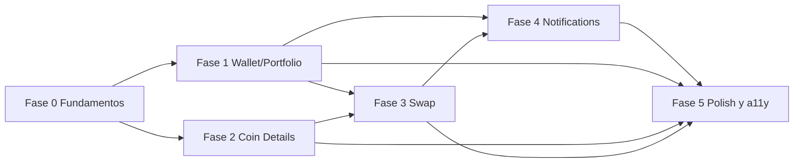

# Indice de Fases — Crypto Wallet Trading Simulator

Este directorio contiene los planes operativos de las 6 fases del producto. Cada `.md` esta pensado como **briefing autocontenido para un subagente** despachado por el agente principal mediante `Task` con `subagent_type: "generalPurpose"`.

El plan maestro de orquestacion vive en `/Users/marcmaciasdev/.cursor/plans/crypto_wallet_phased_plan_28fc2010.plan.md` y NO debe editarse desde aqui.

## Indice

1. [Fase 0 — Fundamentos compartidos](`/Users/marcmaciasdev/Desktop/belo_test/docs/architecture/phases/00-foundations.md`)
2. [Fase 1 — Wallet / Portfolio](`/Users/marcmaciasdev/Desktop/belo_test/docs/architecture/phases/01-wallet-portfolio.md`)
3. [Fase 2 — Coin Details](`/Users/marcmaciasdev/Desktop/belo_test/docs/architecture/phases/02-coin-details.md`)
4. [Fase 3 — Swap / Exchange](`/Users/marcmaciasdev/Desktop/belo_test/docs/architecture/phases/03-swap-exchange.md`)
5. [Fase 4 — Notifications](`/Users/marcmaciasdev/Desktop/belo_test/docs/architecture/phases/04-notifications.md`)
6. [Fase 5 — Polish y a11y](`/Users/marcmaciasdev/Desktop/belo_test/docs/architecture/phases/05-polish-a11y.md`)

## Mapa de dependencias

## Reglas globales heredadas (innegociables)

Todas las fases respetan los contratos definidos en:

- `/Users/marcmaciasdev/Desktop/belo_test/docs/architecture/tdd-integration-vision.md`
- `/Users/marcmaciasdev/Desktop/belo_test/docs/architecture/ui-work-rules.md`
- `/Users/marcmaciasdev/Desktop/belo_test/.cursor/skills/tdd-integration-playbook/SKILL.md`
- `/Users/marcmaciasdev/Desktop/belo_test/.cursor/skills/ui-feature-playbook/SKILL.md`

Resumen operativo:

- TDD de integracion red -> green -> refactor por cada comportamiento nuevo. No se implementa codigo de feature sin un test rojo previo en `tests/integration/<feature>/`.
- Mock unicamente en la frontera HTTP (`/Users/marcmaciasdev/Desktop/belo_test/src/shared/http/`). Prohibido mockear hooks del feature, providers o stores globales.
- Estructura por feature: `src/features/<dominio>/{screens,components,services,lib,state,types.ts,index.ts}` siguiendo el patron de `src/features/market/`.
- Dependencias unicamente `features -> shared` y `features -> components/ui`. `shared` y `playground` nunca importan de `features`.
- Estados UX obligatorios para datos remotos: `loading`, `error`, `empty`, `success` y `retry` cuando aplica.
- Render real en tests con `/Users/marcmaciasdev/Desktop/belo_test/src/shared/test/renderWithProviders.tsx` o equivalente extendido (Navigation, ThemeProvider) que la Fase 0 deja listo.

## Protocolo de despacho a subagentes

El agente principal NO implementa. Para cada fase ejecuta el siguiente protocolo:

1. **Pre-flight**: confirmar que las fases dependientes (ver mermaid) estan cerradas con DoD verde.
2. **Despacho**: lanzar `Task` con `subagent_type: "generalPurpose"`, `run_in_background: false`, y como prompt el bloque "Prompt listo para el subagente" del `.md` correspondiente. Incluir referencia explicita al `.md` de la fase.
3. **Restricciones obligatorias en el prompt**:
   - Leer en orden: el `.md` de la fase, `docs/architecture/tdd-integration-vision.md`, `docs/architecture/ui-work-rules.md`, ambos `SKILL.md`, y el feature de referencia `src/features/market/`.
   - Aplicar TDD red -> green -> refactor.
   - Prohibido mockear hooks/providers/stores globales.
   - Mock solo en `src/shared/http/`.
   - Reportar al final con el formato de "Reporte esperado del subagente".
4. **Recepcion del reporte**: el agente principal solo lee el reporte; no inspecciona internals.
5. **Validacion contra DoD**: verificar checklist `- [ ]` del `.md`. Si algo falta, reabrir con feedback puntual; no mezclar con la siguiente fase.
6. **Regla de no avanzar**: ninguna fase posterior arranca hasta que la fase actual tenga DoD 100% verde.

### Comandos de validacion estandar

El agente principal debe pedir al subagente que adjunte la salida (o resumen confiable) de:

- `npm test -- tests/integration/<feature>` — suite de la fase.
- `npm run lint` — sin warnings nuevos.
- `npm test` — suite completa, para detectar regresiones cruzadas (a partir de Fase 1).

### Criterios de aceptacion transversales

- Cada PR de fase incluye al menos un test rojo previo evidenciado en el reporte.
- Cobertura de escenarios `success/empty/error/retry` cuando el flujo lo permite.
- Persistencia validada con rehidratacion en tests para stores con `persist`.
- Playground actualizado solo si la fase introduce primitives o patrones nuevos.
- Sin emojis ni copia decorativa que oculte logica.

## Convenciones de fixtures y tests

- Fixtures de frontera externa en `/Users/marcmaciasdev/Desktop/belo_test/src/shared/test/fixtures/<feature>.ts`.
- Naming de test: `deberia <resultado visible> cuando <condicion>`.
- Agrupacion: `tests/integration/<feature>/<flujo>.test.tsx`.
- Para escenarios con persistencia: render -> assert -> unmount -> nuevo render -> assert de rehidratacion.

## Estado de avance

El estado de cada fase (pendiente, en curso, validada) lo lleva el plan maestro. Este indice solo orquesta documentacion.
